# Part 1. Запуск нескольких docker-контейнеров с использованием docker compose

### создаем контейнеры для dataset и rabbit 

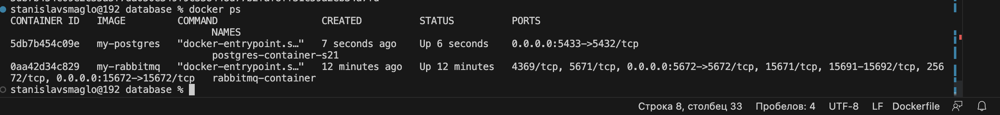

### создаем образ для session-service

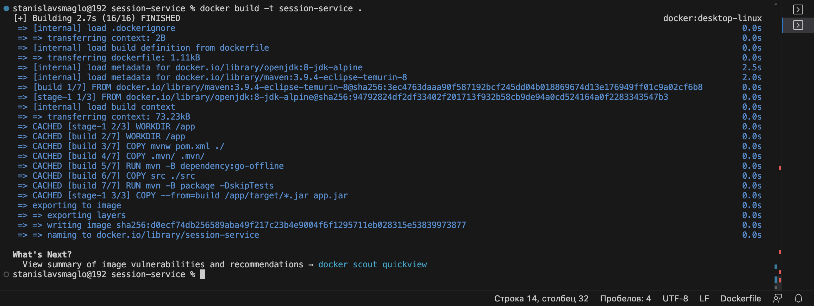

### создаем образы остальных серсивос 

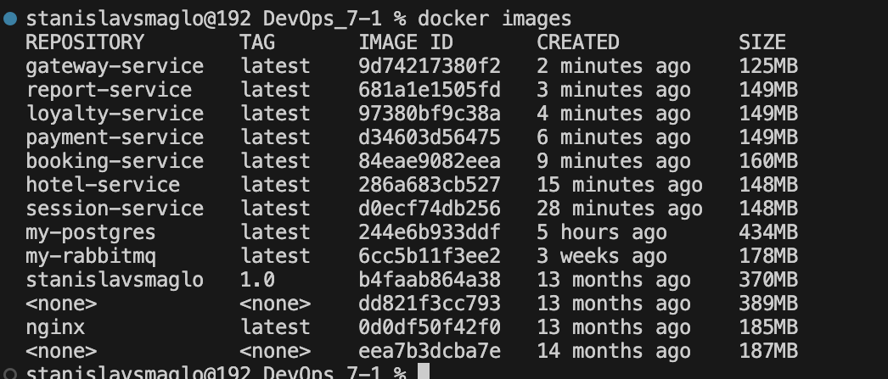

### создаем файл yml , поднимаем compose

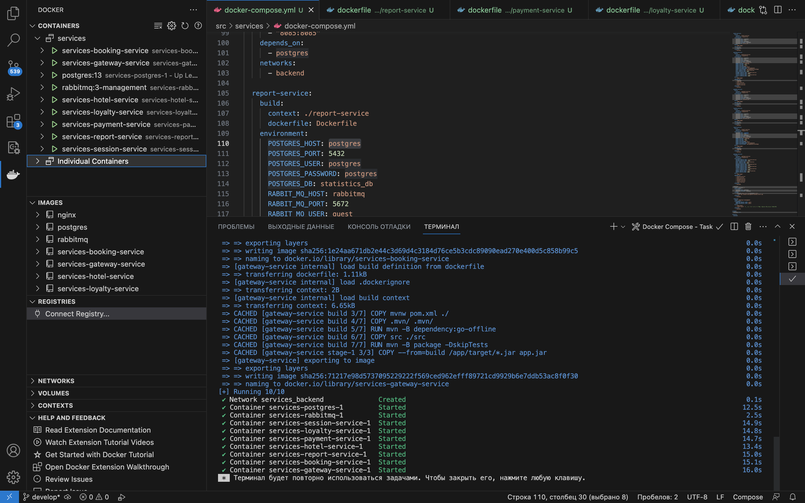

### пишем compose up и проводим тесты postman 

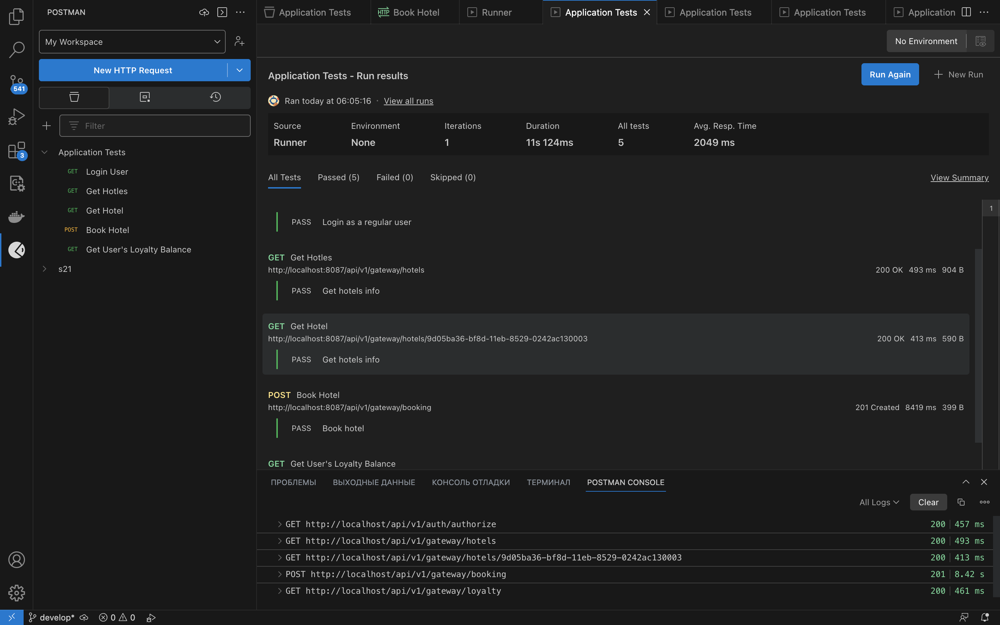
 
## Part 2. Создание виртуальных машин

###  Подняли машину

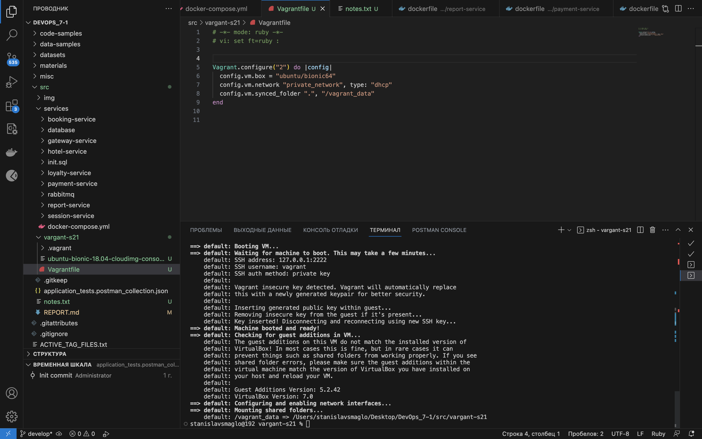

###  Файлы скопированы на машину

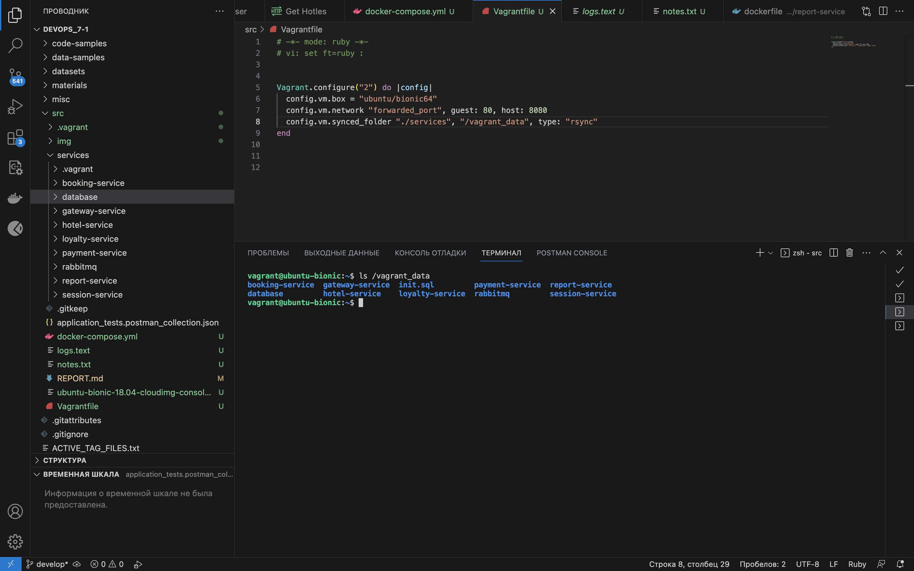

###  Машина уничтожена 

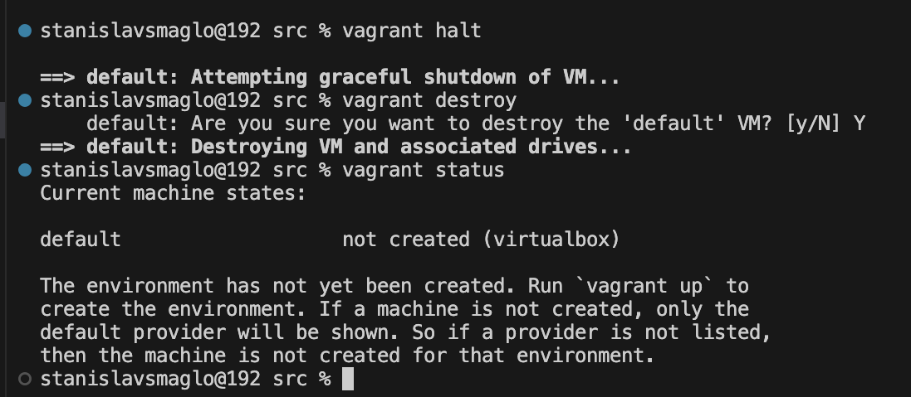

## Part 3. Создание простейшего docker swarm

### Поднял три машины, написал скрипт в vargatfile на установку докера и подключению к swarp

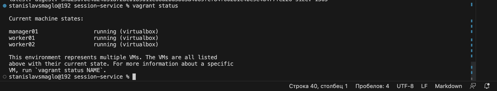

### запушили образы в docker hub

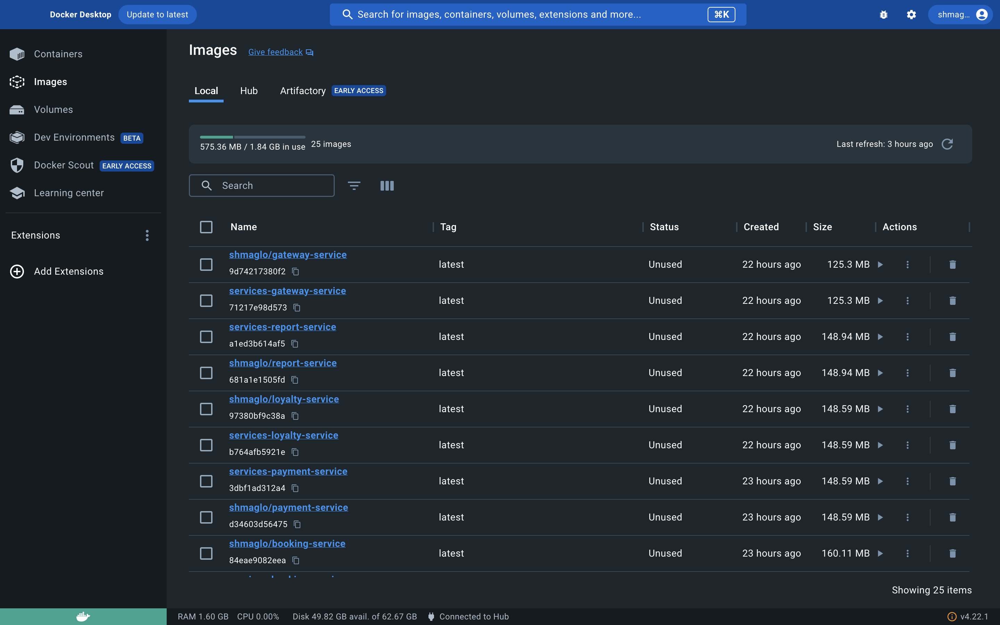

### подняли swarp узел и задеплоили 

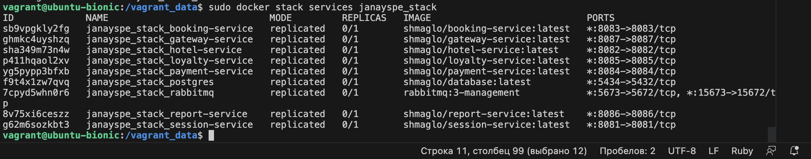

### настроили proxi и провели тесты 

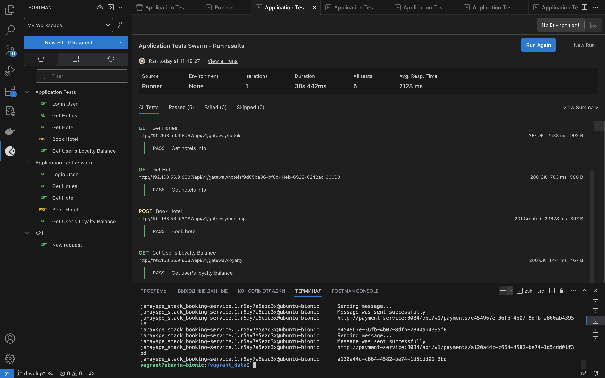

### контейнеры на узлах 

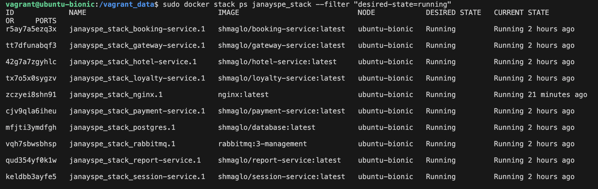

### дашборд в portanier

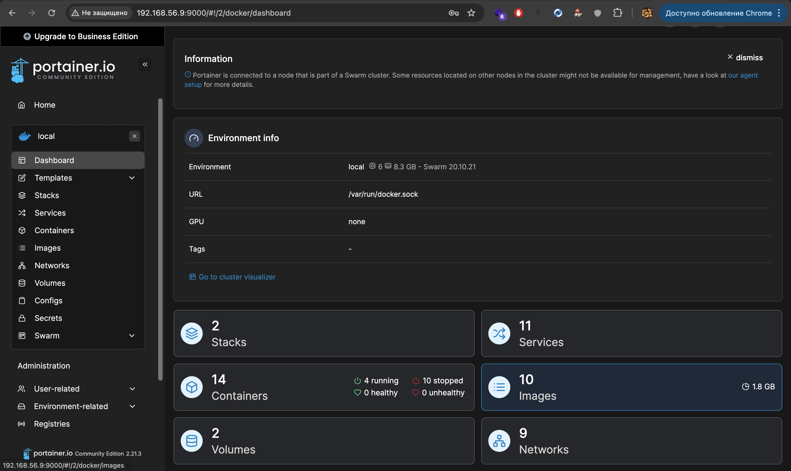
